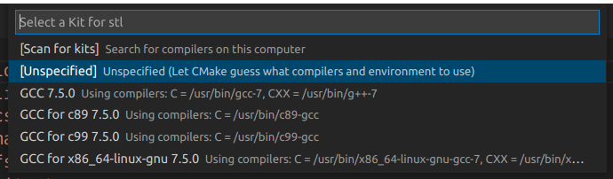

Структура проекта
-----------------

1. linalg.h и linalg.cpp - библиотека для работы с векторно-матричной алгеброй (также написана мной). можно не вникать. 
2. main.ccp - исполнительный файл непосредственно с кодом программы. лучше вникнуть.
3. CMakeLists.txt - файл для линковки. т.е. в нём инструкция для компилятора как и какие библиотеки подключать. можно не вникать.
4. 1019.rtcm и 1002.rtcm - файлы, которые содержать rtcm-пакеты и считываются программой. Название говорит само за себя.

Как собрать и запустить проект?
-------------------------------
1. уставновить visual studio code.
2. установить cmake.
3. установить компилятор для c++ (я для линукса использую GDB).
4. в visual studio code установить расширения: 
	- C/C++	(ms-vscode.cpptools), ссылка на Visual Studio Marketplace: 
	https://marketplace.visualstudio.com/items?itemName=ms-vscode.cpptools
	- CMake (twxs.cmake), ссылка на Visual Studio Marketplace: 
	https://marketplace.visualstudio.com/items?itemName=twxs.cmake
	- CMake Tools (ms-vscode.cmake-tools), ссылка на Visual Studio Marketplace: 
	https://marketplace.visualstudio.com/items?itemName=ms-vscode.cmake-tools
5. открыть папку с проектом в vscode.
6. нажать ctrl+shift+B (собрать проект).
7. выбрать во всплывающем окне: [Unspecified] Unspecified (Let Cmake guess what compilers and environment to use).

8. можно запускать.

main.cpp
--------

Тут самое главное. Комментарии подписаны довольно подробно.
